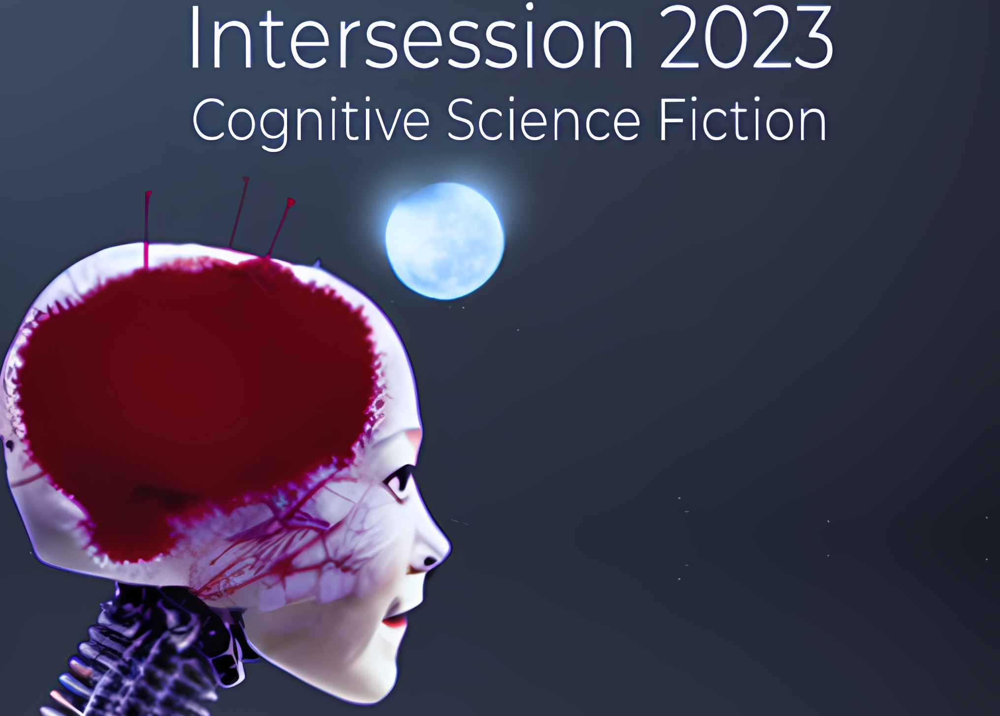

<!---->

# Cognitive Science Fiction

This is the course website Cognitive Science Fiction in Intersession 2023. 

## Syllabus

In the syllabus tab, you will find all the relavent course policies and proceedures.
 

## Schedule

There you will find the schedule of the topics and the reading/viewing/listening assignments for each class. These are expected to be completed prior to class on that day, and there will be comprehension quiz for each assignment.

This will also include links to the daily notes and quizzes. 
